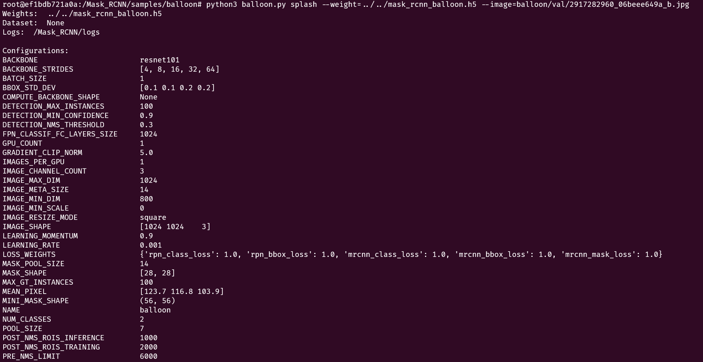
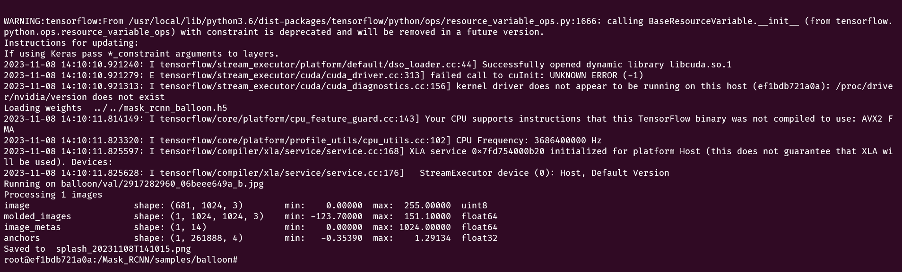
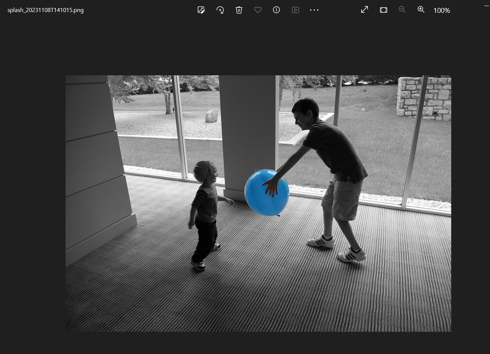
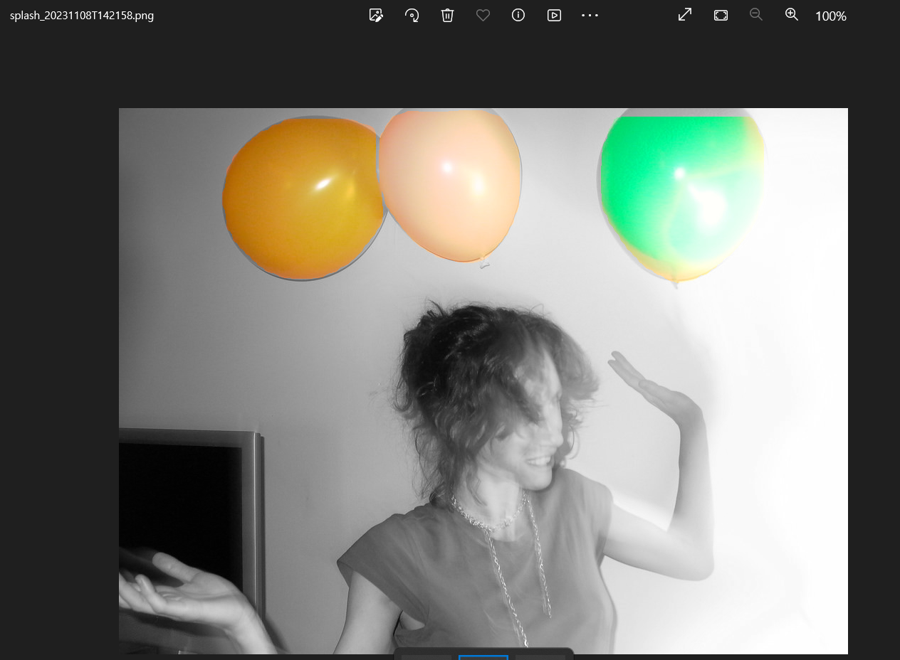
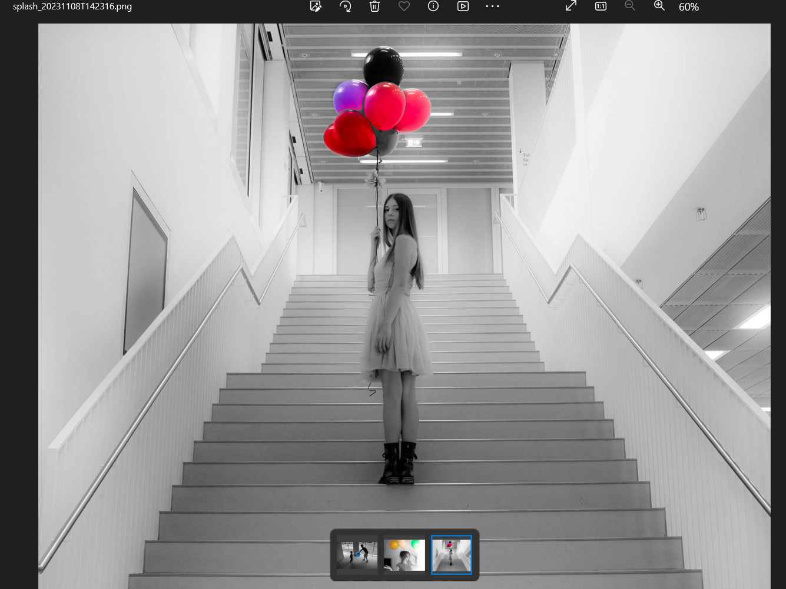
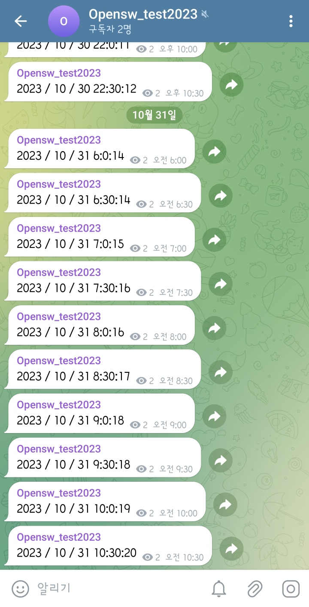

# Homework #1
### Mask_RCNN balloon 이미지 학습
공식 github의 Balloon 예제를 이용해 train하고 test해 객체를 인식한 결과 이미지를 뽑아냈다.
Docker hub에서 공식으로 제공하는 Tensorflow 이미지를 이용했다. (tensorflow/tensorflow:2.2.0-gpu)

  

# Homework #2
### 주기적으로 메시지를 보내는 텔레그램 봇
텔레그램 메시지를 보내는 봇 코드를 서버를 통해 백그라운드 실행 (chatid2.py)  
지정된 시각(오후 11시 ~ 오전 6시)에는 메시지를 보내지 않고, print 로그 메시지만 생성  

